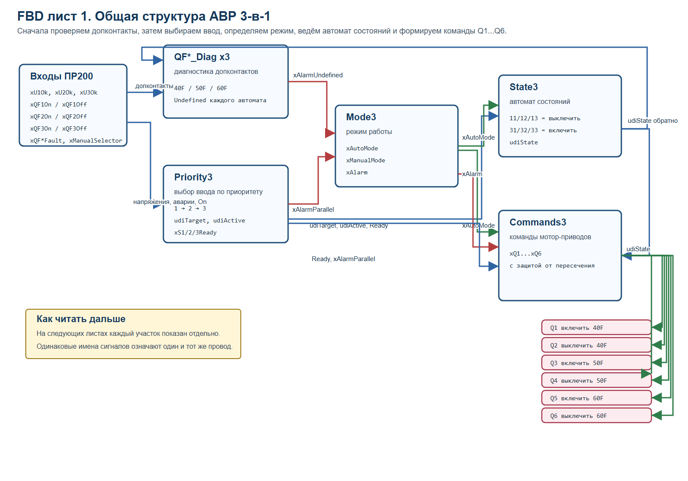
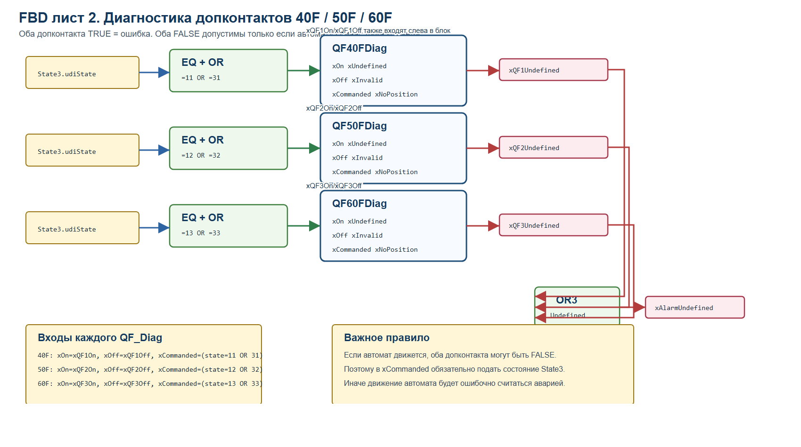
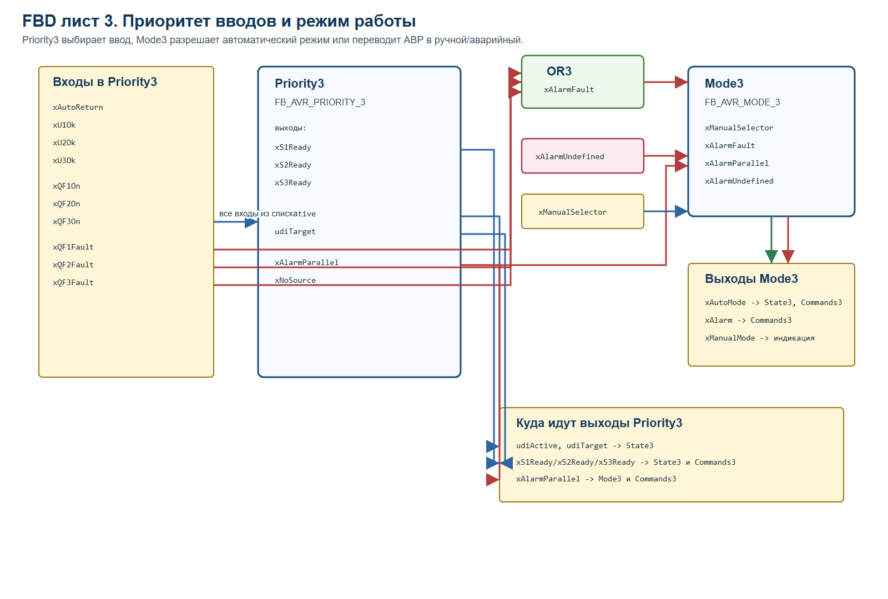
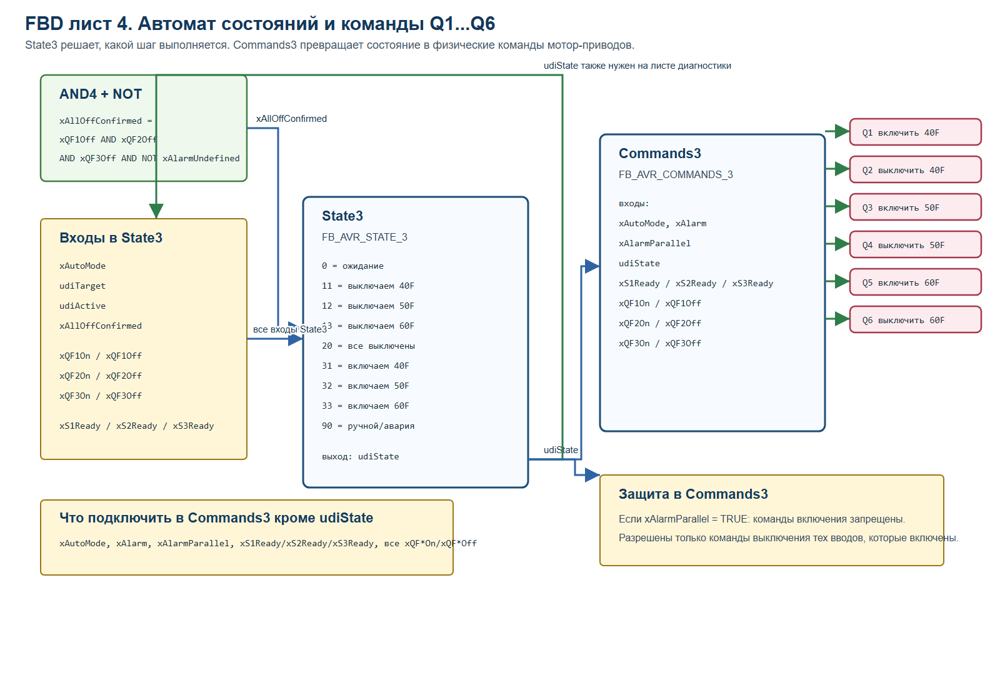

# Понятная FBD-схема по листам

Эти четыре листа сделаны для ручной сборки в Owen Logic FBD.

## Лист 1. Общая структура

## Лист 2. Диагностика допконтактов

## Лист 3. Приоритет и режим

## Лист 4. Автомат состояний и команды

