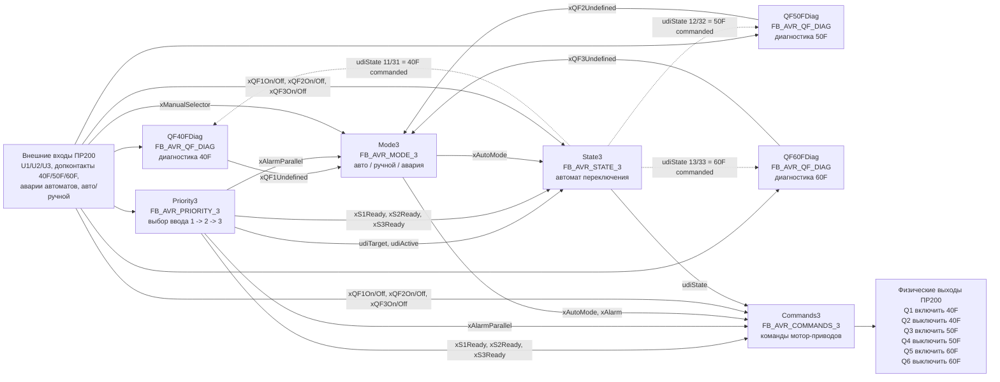
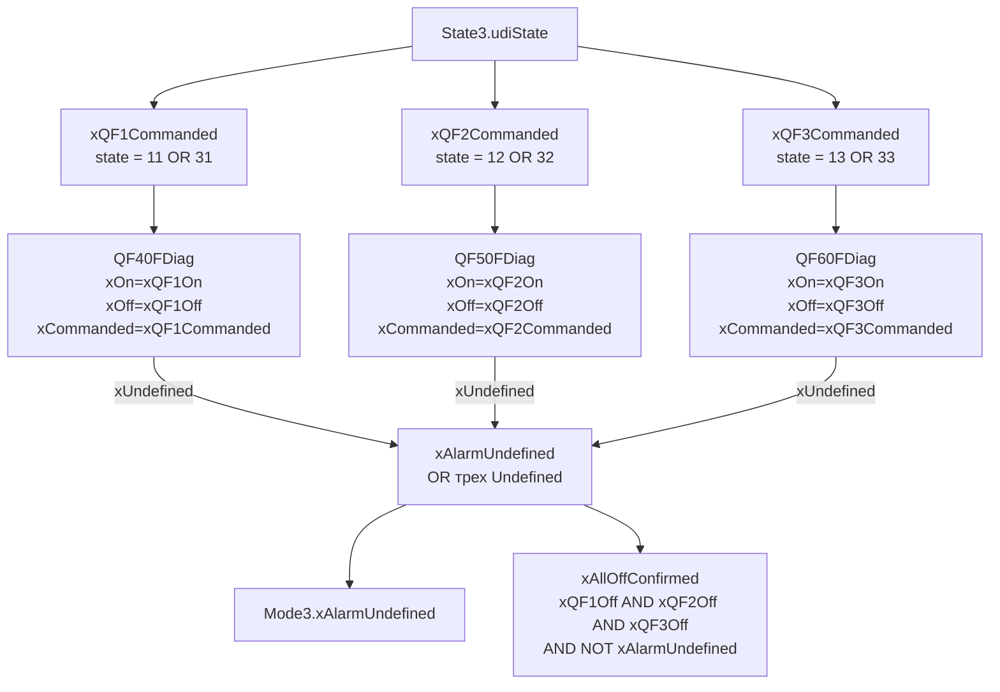
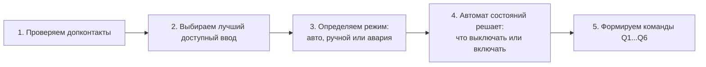

# Визуальная схема соединения блоков АВР

## Общая схема

```mermaid
flowchart LR
    Inputs["Внешние входы ПР200<br/>U1/U2/U3, допконтакты 40F/50F/60F,<br/>аварии автоматов, авто/ручной"]

    D1["QF40FDiag<br/>FB_AVR_QF_DIAG<br/>диагностика 40F"]
    D2["QF50FDiag<br/>FB_AVR_QF_DIAG<br/>диагностика 50F"]
    D3["QF60FDiag<br/>FB_AVR_QF_DIAG<br/>диагностика 60F"]

    Priority["Priority3<br/>FB_AVR_PRIORITY_3<br/>выбор ввода 1 -> 2 -> 3"]
    Mode["Mode3<br/>FB_AVR_MODE_3<br/>авто / ручной / авария"]
    State["State3<br/>FB_AVR_STATE_3<br/>автомат переключения"]
    Commands["Commands3<br/>FB_AVR_COMMANDS_3<br/>команды мотор-приводов"]

    Outputs["Физические выходы ПР200<br/>Q1 включить 40F<br/>Q2 выключить 40F<br/>Q3 включить 50F<br/>Q4 выключить 50F<br/>Q5 включить 60F<br/>Q6 выключить 60F"]

    Inputs --> D1
    Inputs --> D2
    Inputs --> D3
    Inputs --> Priority

    D1 -->|"xQF1Undefined"| Mode
    D2 -->|"xQF2Undefined"| Mode
    D3 -->|"xQF3Undefined"| Mode

    Priority -->|"udiTarget, udiActive"| State
    Priority -->|"xS1Ready, xS2Ready, xS3Ready"| State
    Priority -->|"xS1Ready, xS2Ready, xS3Ready"| Commands
    Priority -->|"xAlarmParallel"| Mode
    Priority -->|"xAlarmParallel"| Commands

    Inputs -->|"xManualSelector"| Mode
    Mode -->|"xAutoMode"| State
    Mode -->|"xAutoMode, xAlarm"| Commands

    Inputs -->|"xQF1On/Off, xQF2On/Off, xQF3On/Off"| State
    Inputs -->|"xQF1On/Off, xQF2On/Off, xQF3On/Off"| Commands

    State -->|"udiState"| Commands
    Commands --> Outputs

    State -. "udiState 11/31 = 40F commanded" .-> D1
    State -. "udiState 12/32 = 50F commanded" .-> D2
    State -. "udiState 13/33 = 60F commanded" .-> D3
```

## Детализация диагностики допконтактов

```mermaid
flowchart TB
    State["State3.udiState"]

    C1["xQF1Commanded<br/>state = 11 OR 31"]
    C2["xQF2Commanded<br/>state = 12 OR 32"]
    C3["xQF3Commanded<br/>state = 13 OR 33"]

    D1["QF40FDiag<br/>xOn=xQF1On<br/>xOff=xQF1Off<br/>xCommanded=xQF1Commanded"]
    D2["QF50FDiag<br/>xOn=xQF2On<br/>xOff=xQF2Off<br/>xCommanded=xQF2Commanded"]
    D3["QF60FDiag<br/>xOn=xQF3On<br/>xOff=xQF3Off<br/>xCommanded=xQF3Commanded"]

    U["xAlarmUndefined<br/>OR трех Undefined"]

    State --> C1 --> D1
    State --> C2 --> D2
    State --> C3 --> D3

    D1 -->|"xUndefined"| U
    D2 -->|"xUndefined"| U
    D3 -->|"xUndefined"| U

    U --> Mode["Mode3.xAlarmUndefined"]
    U --> AllOff["xAllOffConfirmed<br/>xQF1Off AND xQF2Off AND xQF3Off<br/>AND NOT xAlarmUndefined"]
```

## Смысл потока сигналов

```mermaid
flowchart LR
    A["1. Проверяем допконтакты"] --> B["2. Выбираем лучший доступный ввод"]
    B --> C["3. Определяем режим:<br/>авто, ручной или авария"]
    C --> D["4. Автомат состояний решает:<br/>что выключать или включать"]
    D --> E["5. Формируем команды Q1...Q6"]
```

