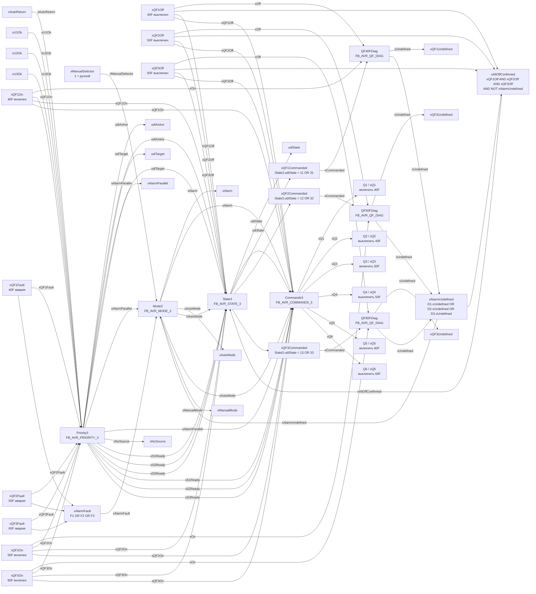
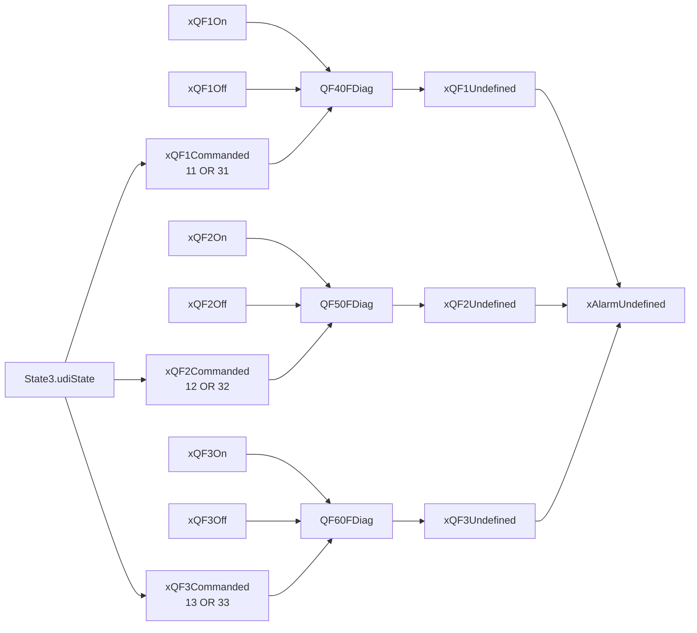
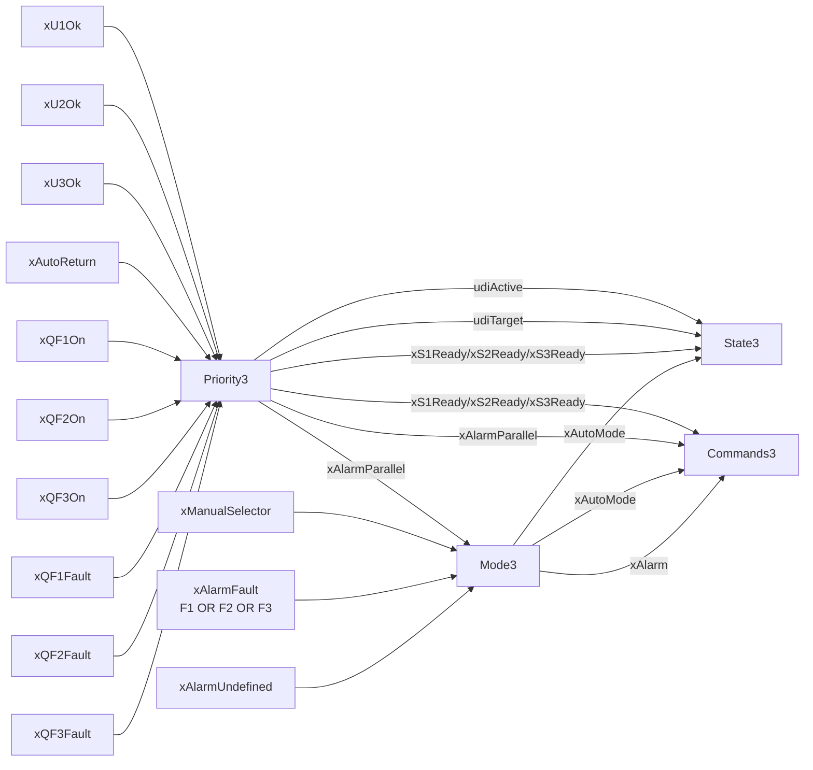
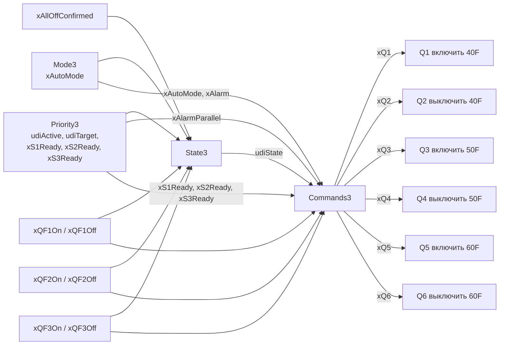

# Полная блок-схема соединений АВР 3-в-1

Файл показывает все соединения между малыми функциональными блоками из
`FB_AVR_3IN1_PR200_MODULAR.st`.

## 1. Полная схема верхнего уровня

## 2. Диагностика допконтактов

## 3. Приоритет и режим

## 4. Автомат состояний и команды

